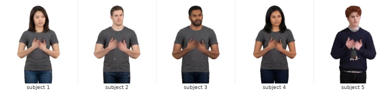
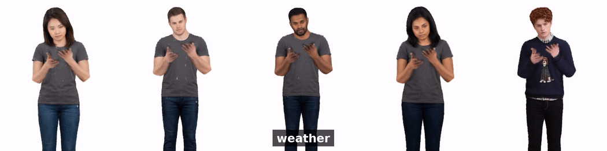

# held-out-glosses

Evaluating sign language generation on signs the model has never seen.



Gloss-level sign production is evaluated almost exclusively under WLASL's
standard splits, which partition **by clip** — so the same sign appears in
training and test, and every reported score describes signs the model has
already seen. This repository holds the code for splitting **by gloss** instead,
the validated metrics that make the comparison meaningful, and the controls that
rule out the obvious alternative explanations.

Headline result: adaptation reaches **0.84 retrieval top-1 on trained glosses**
against a real-clip ceiling of 0.51, and **chance on held-out glosses**. Raising
the training vocabulary from 25 to 99 glosses does not change this, and neither
does more data or longer training.

<p align="center">
  
</p>

---

## Start here

| I want to… | Go to |
|---|---|
| Reproduce the main result | [`eval/`](eval/) + [`splits/`](splits/) |
| Generate a signing video from one photo | [`pipeline/`](pipeline/) |
| Re-run the scaling experiment | [`scaling/`](scaling/) |
| Check the result isn't an artifact | [`controls/`](controls/) |
| Read the paper | [`paper/`](paper/) |
| Avoid the traps that cost us days | [`KNOWN_ISSUES.md`](KNOWN_ISSUES.md) |

---

## Repository layout

```
held-out-glosses/
├── README.md
├── KNOWN_ISSUES.md          ← read before debugging anything
├── LICENSE                  Apache-2.0
├── requirements.txt
│
├── assets/                  ← the images and clips on this page
│   ├── teaser.png                the five-subject strip (fig_identity.pdf as PNG)
│   ├── demo.gif                  one sign, one subject, loops
│   ├── identity_grid.gif         same motion, five subjects, side by side
│   └── clips/                    s1_cold.mp4, s3_weather.mp4, s5_finish.mp4
│
├── splits/                  ← the smallest useful artifact
│   ├── train.txt                 794 clips, 99 glosses
│   ├── test_unseen.txt           200 clips, 25 held-out glosses
│   ├── seen_glosses.json         the 25 training glosses used as the seen control
│   ├── vocab25.txt               194 clips / 25 glosses
│   ├── vocab50.txt               404 clips / 50 glosses
│   ├── vocab99.txt               794 clips / 99 glosses  (== train.txt)
│   ├── budget200.txt             194 clips / 99 glosses  (data-matched to vocab25)
│   └── budget400.txt             404 clips / 99 glosses  (data-matched to vocab50)
│
├── eval/                    ← the measurement, and what validates it
│   ├── retrieval_eval.py         top-1, leave-one-out ceilings, per-clip hits
│   ├── retrieval_stats.py        bootstrap CIs (clustered by gloss) + tests
│   ├── motion_stats.py           per-hand and pooled articulation
│   └── geodesic_validation.py    the same metric recomputed on SO(3)
│
├── controls/                ← why the result is not an artifact
│   ├── memorization_check.py         are generations copies of training clips?
│   ├── centroid_check.py             do they collapse onto a per-gloss prototype?
│   ├── per_gloss_heldout.py          does the aggregate hide learnable signs?
│   ├── multi_subject_spotter.py      does rendered identity move the evaluator?
│   └── spotter_negative_control.py   does the evaluator separate in this prep?
│
├── pipeline/                ← photo + prompt → signing video
│   ├── README.md                 THREE conda envs; read this first
│   ├── signavatars_to_handmdm.py 182-d axis-angle ↔ 274-d 6D (round-trip checked)
│   ├── handmdm_to_lhm.py         motion → LHM SMPL-X frames
│   ├── amplify_hands.py          the per-hand refiner, Eq. (5)
│   ├── apply_adapter.py          learned alternative, for the ablation
│   ├── adapter_v3.py             the adapter model apply_adapter.py loads
│   ├── retarget_loss.py          SMPL-X hand loss the adapter was trained with
│   ├── render.sh                 motion + photo → mp4 (LHM inference)
│   ├── prep_for_spotter.sh       crop/scale/setpts before scoring
│   └── crop_boxes.json           per-signer framing, with how they were measured
│
├── scaling/
│   ├── make_scaling_splits.py    builds splits/ from train.txt, nested + controlled
│   └── run_scaling.sh            trains all arms sequentially
│
├── demo/
│   ├── run_demo.sh               one photo, one prompt, one mp4
│   └── assets/                   example input photo
│
├── results/
│   └── hits/                     per-clip correct/incorrect
│       ├── held/                     adaptation arms, 25 held-out glosses
│       ├── scaling_held/             scaling arms, held-out glosses
│       └── scaling_seen25/           scaling arms, 25 seen glosses
│
└── paper/
    ├── draft.tex
    ├── refs.bib
    └── figures/                  fig1_pipeline.pdf, fig_identity.pdf
```

## Not included

Checkpoints (~3.6 GB per run), extracted features, and `adapter_data.npz`.
Get the source data from SignAvatars and WLASL directly; `splits/` refers to
their clip identifiers only.

## Quick start

```bash
export SA=/path/to/signavatars
python eval/retrieval_eval.py \
    --real_dir feats274 --split $SA/adapter_data_gloss.npz \
    --wlasl $SA/WLASL_v0.3.json --gen mymodel=gen_mymodel
python eval/retrieval_stats.py --hits mymodel=hits_mymodel.json --chance 0.037
```

Report top-1 against the ceiling from the **same gallery** — a seen-gloss score
compared against a held-out ceiling is not a valid comparison, and this is the
mistake the repository exists to make hard.

To render a video from one photograph, see [`demo/run_demo.sh`](demo/run_demo.sh)
and [`pipeline/README.md`](pipeline/README.md).

## Licence and citing

Code is released under the Apache License 2.0 ([`LICENSE`](LICENSE)). The
datasets keep their own licences.

See `paper/refs.bib`. If you use the splits or the evaluation protocol, please
cite the paper and the underlying datasets (SignAvatars, WLASL, How2Sign,
BOBSL) as their licences require.
