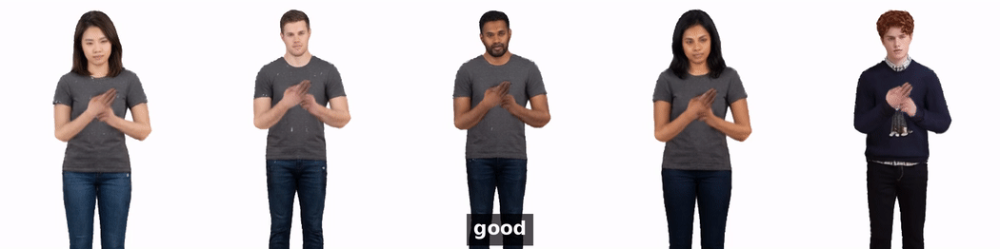
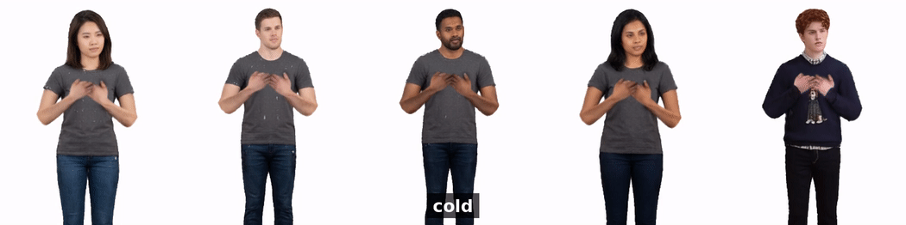
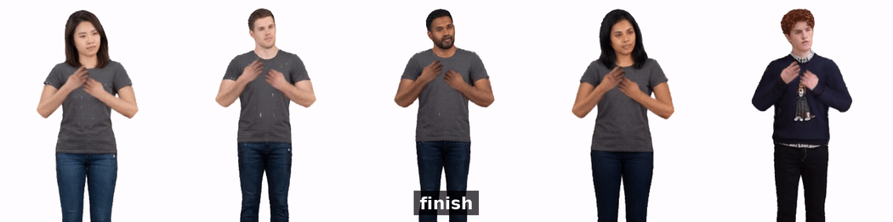
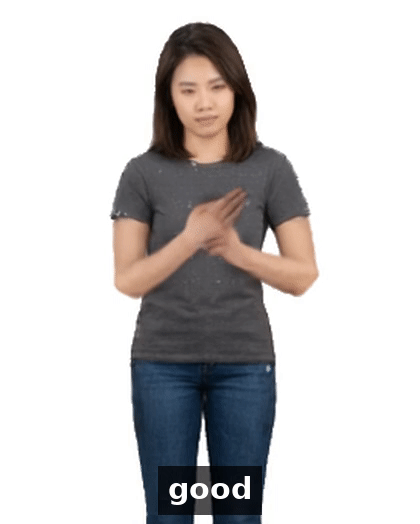
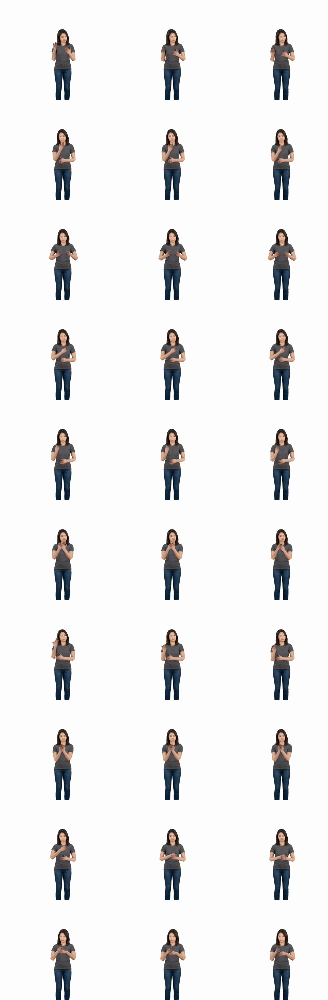
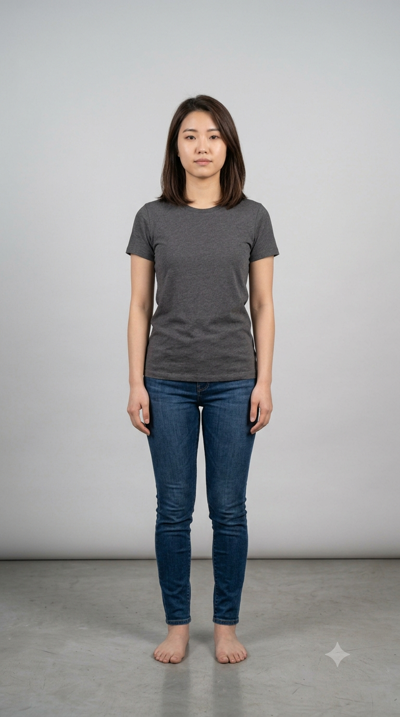
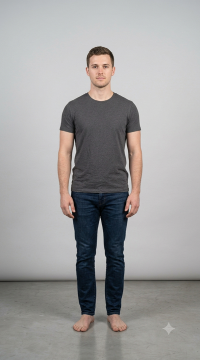
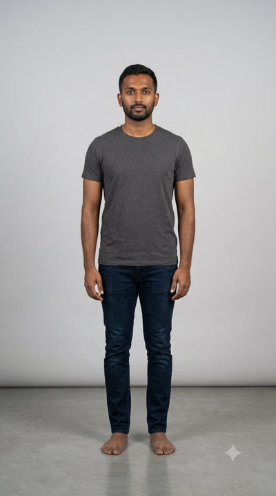
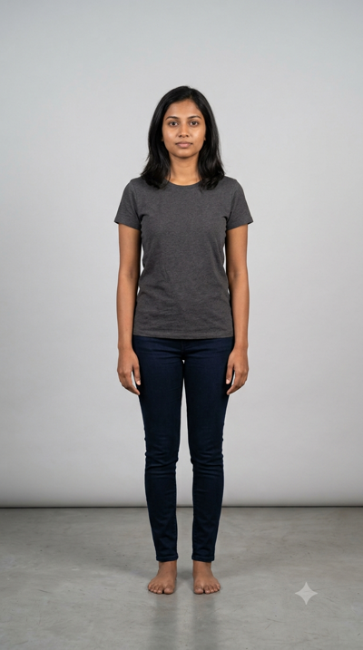
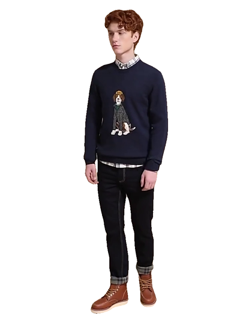

# Demo gallery

Every example here starts from **one photograph** and a text description of the
sign. Nothing about the signer's identity is learned or fine-tuned: the same
generated motion is rendered onto each of the five people below.

Ten signs are shown — `good`, `morning`, `today`, `weather`, `rain`, `cold`,
`drink`, `tea`, `work`, `finish` — each performed by all five signers.

> These are demonstrations of the rendering pipeline, not evidence of sign
> correctness. For that, see the retrieval numbers in the main
> [README](../README.md) and the checks in [`controls/`](../controls/).

---

## One sign, five signers

<p align="center">
  <br>
  <em>good</em>
</p>

<p align="center">
  <br>
  <em>cold</em>
</p>

<p align="center">
  <br>
  <em>finish</em>
</p>

## One signer, the full sequence

<p align="center">
  <br>
  <em>signer 1, all ten signs</em>
</p>

<p align="center">
  <br>
  <em>contact sheet: all ten signs by signer 1, three frames each</em>
</p>

---

## The inputs

One photograph per signer — this is everything the model gets about a person.

| s1 | s2 | s3 | s4 | s5 |
|---|---|---|---|---|
|  |  |  |  |  |

Full-resolution versions are `inputs/s*_original.png`.

---

## Every clip

GitHub plays these in the browser — click any link.

| Sign | All five signers | s1 | s2 | s3 | s4 | s5 |
|---|---|---|---|---|---|---|
| good | [grid](grids/grid_01_good.mp4) | [s1](clips/s1_01_good.mp4) | [s2](clips/s2_01_good.mp4) | [s3](clips/s3_01_good.mp4) | [s4](clips/s4_01_good.mp4) | [s5](clips/s5_01_good.mp4) |
| morning | [grid](grids/grid_02_morning.mp4) | [s1](clips/s1_02_morning.mp4) | [s2](clips/s2_02_morning.mp4) | [s3](clips/s3_02_morning.mp4) | [s4](clips/s4_02_morning.mp4) | [s5](clips/s5_02_morning.mp4) |
| today | [grid](grids/grid_03_today.mp4) | [s1](clips/s1_03_today.mp4) | [s2](clips/s2_03_today.mp4) | [s3](clips/s3_03_today.mp4) | [s4](clips/s4_03_today.mp4) | [s5](clips/s5_03_today.mp4) |
| weather | [grid](grids/grid_04_weather.mp4) | [s1](clips/s1_04_weather.mp4) | [s2](clips/s2_04_weather.mp4) | [s3](clips/s3_04_weather.mp4) | [s4](clips/s4_04_weather.mp4) | [s5](clips/s5_04_weather.mp4) |
| rain | [grid](grids/grid_05_rain.mp4) | [s1](clips/s1_05_rain.mp4) | [s2](clips/s2_05_rain.mp4) | [s3](clips/s3_05_rain.mp4) | [s4](clips/s4_05_rain.mp4) | [s5](clips/s5_05_rain.mp4) |
| cold | [grid](grids/grid_06_cold.mp4) | [s1](clips/s1_06_cold.mp4) | [s2](clips/s2_06_cold.mp4) | [s3](clips/s3_06_cold.mp4) | [s4](clips/s4_06_cold.mp4) | [s5](clips/s5_06_cold.mp4) |
| drink | [grid](grids/grid_07_drink.mp4) | [s1](clips/s1_07_drink.mp4) | [s2](clips/s2_07_drink.mp4) | [s3](clips/s3_07_drink.mp4) | [s4](clips/s4_07_drink.mp4) | [s5](clips/s5_07_drink.mp4) |
| tea | [grid](grids/grid_08_tea.mp4) | [s1](clips/s1_08_tea.mp4) | [s2](clips/s2_08_tea.mp4) | [s3](clips/s3_08_tea.mp4) | [s4](clips/s4_08_tea.mp4) | [s5](clips/s5_08_tea.mp4) |
| work | [grid](grids/grid_09_work.mp4) | [s1](clips/s1_09_work.mp4) | [s2](clips/s2_09_work.mp4) | [s3](clips/s3_09_work.mp4) | [s4](clips/s4_09_work.mp4) | [s5](clips/s5_09_work.mp4) |
| finish | [grid](grids/grid_10_finish.mp4) | [s1](clips/s1_10_finish.mp4) | [s2](clips/s2_10_finish.mp4) | [s3](clips/s3_10_finish.mp4) | [s4](clips/s4_10_finish.mp4) | [s5](clips/s5_10_finish.mp4) |

**Full sequences:** [s1](stories/story_s1.mp4) · [s2](stories/story_s2.mp4) ·
[s3](stories/story_s3.mp4) · [s4](stories/story_s4.mp4) · [s5](stories/story_s5.mp4)

**Showcase:** [demo_full.mp4](showcase/demo_full.mp4) — 69 s, titles, every grid
and every sequence · [demo_grid.mp4](showcase/demo_grid.mp4) — 9 s, the grids alone ·
[demo_A_five_signers.mp4](showcase/demo_A_five_signers.mp4) — 9 s, an earlier
320-wide build of the same grids, kept for comparison

---

## Folders

| Folder | What's in it |
|---|---|
| `inputs/` | the five source photographs, `_small` (400 px) and `_original` |
| `grids/` | one sign, five signers side by side (10 clips) |
| `clips/` | every signer × every sign, captioned (50 clips) |
| `stories/` | one signer performing all ten signs (5 clips, 9 s each) |
| `showcase/` | the stitched presentation videos |
| `gifs/` | the animated versions displayed inline on this page |
| `sheets/` | frame-by-frame contact sheet |
| `assets/` | the example photograph `run_demo.sh` uses |

## Making your own

```bash
conda activate handmdm
export HANDMDM_DIR=/path/to/HandMDM LHM_DIR=/path/to/LHM
bash demo/run_demo.sh demo/inputs/s1_original.png \
  "Flat open hand fingers together fingertips touching the chin then moved forward and downward away from the face in a single smooth arc" \
  thankyou.mp4
```

The prompt describes the sign's articulation, not its meaning. See
[`../pipeline/README.md`](../pipeline/README.md) for the three conda
environments this needs.
